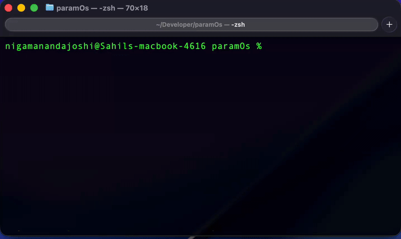
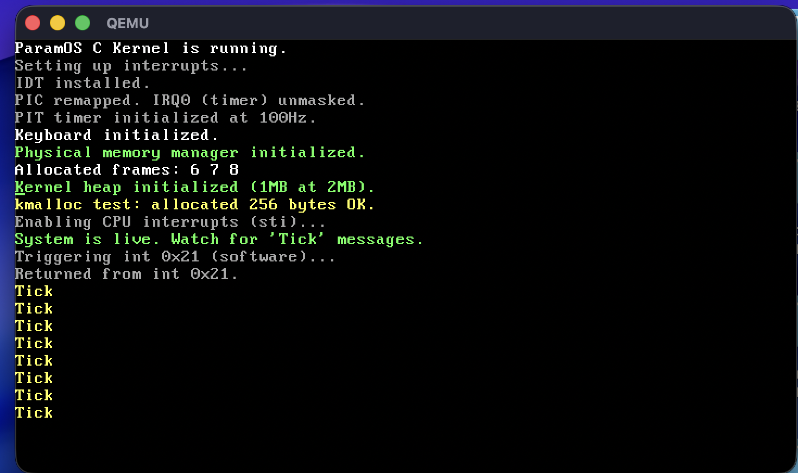

# ParamOS — A From-Scratch 32-bit Operating System


ParamOS is a **from-scratch 32-bit x86 operating system** developed as a **systems research and learning platform**.  
The project focuses on understanding *why* operating system abstractions exist by incrementally building them from the lowest levels of the hardware interface upward.

Rather than aiming for feature completeness, ParamOS emphasizes **architectural clarity**, **correctness**, and **explicit design trade-offs** across bootstrapping, interrupt handling, memory management, and task abstraction.

---

## 🖥️ System Snapshots



ParamOS running under QEMU, demonstrating successful boot, interrupt handling, memory initialization, task creation, and an interactive kernel shell.

### Kernel Initialization & Interrupt Handling



---

## Research Orientation

ParamOS is developed with a **research-oriented mindset**, where implementation choices are guided by clarity, debuggability, and extensibility rather than immediate feature density.

The project serves as a foundation for exploring topics such as interrupt-driven execution, memory management strategies, scheduler design, and kernel–user separation — areas directly relevant to **systems and infrastructure research**.

---

## Project Philosophy

ParamOS intentionally begins execution at the lowest possible point in the system lifecycle — **CPU reset and BIOS handoff** — to expose the full chain of responsibilities an operating system must assume.

Each subsystem is introduced only after its prerequisites are understood and validated, following an **incremental kernel construction model** commonly used in operating systems research and teaching kernels.

---

## 🏗️ System Architecture

For a visual overview of the kernel components and their interactions, see the [Architecture Diagram](docs/architecture.md).


---

## Boot Process Overview

ParamOS implements the complete early boot pipeline:

**BIOS → Real Mode → A20 → GDT → Protected Mode → C Kernel**

### Bootloader Responsibilities
- Initialize stack in real mode  
- Enable the A20 line for memory access beyond 1MB  
- Load a minimal Global Descriptor Table (GDT)  
- Switch the CPU into 32-bit protected mode  
- Transfer control to the kernel entry point  

The bootloader is deliberately kept minimal to isolate architectural responsibilities such as real-mode constraints, descriptor-based memory models, and controlled transition into protected mode. This separation avoids coupling policy decisions with hardware-mandated initialization steps.

---

## Freestanding Kernel

Once in protected mode, execution enters the kernel through an assembly stub that sets up registers and calls `kernel_main()`.

The kernel is written in **freestanding C**:
- No standard library  
- No libc  
- No runtime initialization  
- Compiled with `-ffreestanding` and `-nostdlib`  

Operating in a fully freestanding environment forces all assumptions about memory layout, stack usage, and control flow to be made explicit. This mirrors real-world kernel and runtime development, where no implicit runtime guarantees exist.

---

## Kernel Subsystems (Current State)

### Interrupt Handling
- Interrupt Descriptor Table (IDT) setup
- PIC remapping
- Hardware IRQ handling
- Software interrupt support
- PIT timer initialized at 100Hz

Interrupt handling is implemented explicitly to study asynchronous control flow, hardware-driven preemption points, and safe kernel entry paths. Timer interrupts are currently used for system timekeeping and controlled experimentation.

---

### VGA Text Console
- Direct memory-mapped I/O at `0xB8000`
- Character output, scrolling, clearing, and colors
- Primary debugging and interaction interface during early kernel development

---

### Hardware I/O Layer
- `inb`, `outb`, `inw`, `outw` implemented via inline assembly
- Forms the foundation for interrupt controllers and device drivers

---

### Physical Memory Management
- Basic physical frame allocator
- Tracks allocated frames during early kernel initialization
- Provides groundwork for paging and virtual memory support

---

### Kernel Heap (`kmalloc`)
- Monotonic kernel heap allocator
- Enables dynamic allocation of kernel objects
- Used for task structures and shell components
- Memory reclamation (`kfree`) intentionally deferred

Deferring `kfree()` is a **conscious design decision** that simplifies reasoning about allocator correctness during early kernel bring-up and task subsystem development.

---

### Task Abstraction
- Minimal `task_struct` (Process Control Block)
- Per-task kernel stack allocated via `kmalloc`
- Task creation and registration supported

At this stage, the task subsystem focuses on representation and isolation of execution state. Scheduling policy and task lifecycle management are intentionally deferred to later development phases.

---

### Kernel Shell (Early)
- Interactive shell running in kernel mode
- Keyboard input with basic line editing
- Supported commands:
  - `help` — list available commands
  - `clear` — clear the screen
  - `echo` — echo input text
  - `mem` — display memory information
  - `ps` — list registered tasks
  - `ver` — display OS version

The shell functions as a **diagnostic and validation tool**, allowing kernel subsystems to be exercised in a controlled environment.

---

## Repository Structure

```
ParamOS/
├── src/
│   ├── boot.asm            # 16-bit bootloader
│   ├── kernel_entry.asm    # Protected mode entry stub
│   ├── kernel.c            # Kernel initialization
│   ├── console.c/h         # VGA text console
│   ├── ports.c/h           # Port I/O utilities
│   ├── idt.c/h             # Interrupt Descriptor Table
│   ├── pic.c/h             # PIC configuration
│   ├── irq.c/h             # IRQ dispatcher
│   ├── timer.c/h           # PIT timer
│   ├── keyboard.c/h        # PS/2 keyboard driver
│   ├── frames.c/h          # Physical memory manager
│   ├── kmalloc.c/h         # Kernel heap allocator
│   ├── task.c/h            # Task abstraction
│   ├── shell.c/h           # Kernel shell
│   ├── isr.asm             # Interrupt service routines
│   ├── linker.ld           # Kernel linker script
│   └── stdint.h
│
├── build/                  # Compiled binaries
├── docs/                   # Screenshots and documentation
├── legacy/                 # Early ASM-only version
└── Makefile
```

---

## Current Capabilities Summary

- Custom 16-bit bootloader
- Protected mode transition with GDT
- Freestanding 32-bit C kernel
- VGA text console
- Hardware port I/O
- IDT, PIC, and IRQ handling
- PIT timer interrupts
- Physical memory frame allocator
- Kernel heap allocator (`kmalloc`)
- Task abstraction with per-task kernel stacks
- Interactive kernel shell

---

## Development Roadmap

### In Progress
- Context switching primitives
- Cooperative task switching
- Shell command expansion

### Planned
- Scheduler design (policy separated from mechanism)
- Memory reclamation (`kfree`) and allocator robustness
- Paging and virtual memory
- User-mode isolation
- System call interface
- Basic file system

---

## Building & Running

### Prerequisites
```sh
x86_64-elf-gcc
nasm
qemu
```

### Build
```sh
make
```

### Run
```sh
make run
```

---

## Closing Note

ParamOS is not intended to be a production operating system. It is a **systems exploration project** designed to deeply understand kernel architecture, memory management, interrupt handling, task control, and hardware interaction — built carefully from first principles.

---

## License

MIT License
