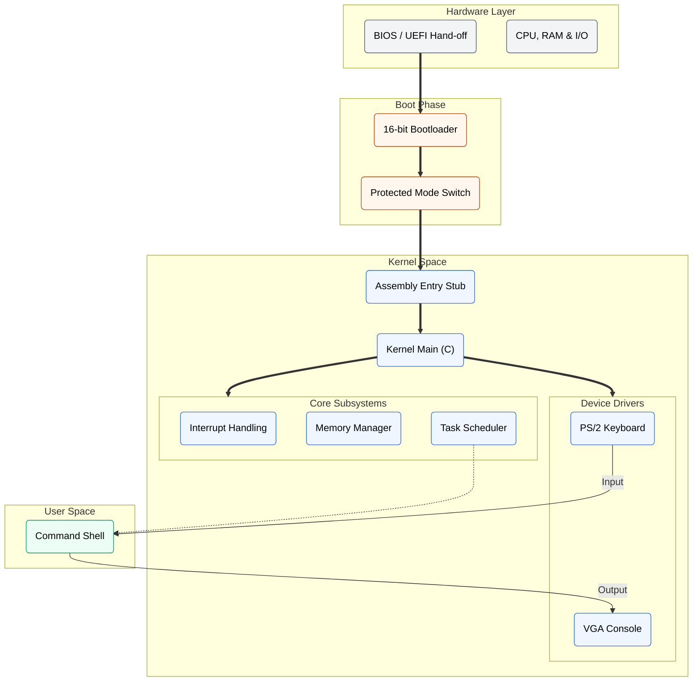
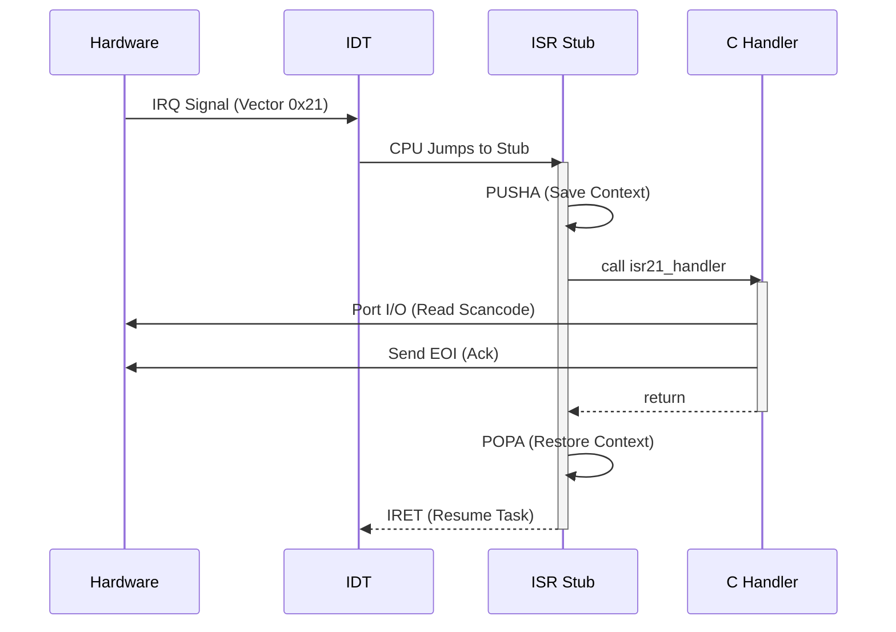

# System Architecture

ParamOS is a 32-bit x86 monolithic kernel developed for systems research. This document details the internal design, highlighting the memory model, interrupt mechanics, and task switching logic.

## 1. High-Level Design

The kernel adheres to a straightforward monolithic structure. It boots from a 16-bit real mode environment, transitions to 32-bit protected mode, and executes a C-based kernel. Usage of abstraction layers is minimized to maintain a clear, debuggable execution pipeline.

## 2. Memory Organization

ParamOS utilizes a flat memory model. The lower 1MB is reserved for BIOS structures and the bootloader, while the kernel is linked to load at `0x10000` (64KB). This placement avoids the Real Mode IVT (0x000-0x3FF) but keeps the kernel in low memory.

### Physical Map
*   **0x0000 - 0x0500**: BIOS IVT & Data Area.
*   **0x7C00 - 0x7E00**: Bootloader execution point.
*   **0x10000**: Kernel Code & Data (High half of low memory).
*   **0xB8000**: VGA Video Memory (Memory Mapped I/O).
*   **0x200000 (2MB)**: Kernel Heap start.

```mermaid
block-beta
    columns 1
    block:Map
        space
        BIOS_IVT["reserved: BIOS IVT (0x0000)"]
        Boot["boot: Bootloader (0x7C00)"]
        KernelCode["code: Kernel Entry (0x10000)"]
        VGA["mmio: VGA Buffer (0xB8000)"]
        KernelHeap["heap: Kernel Heap (0x200000)"]
        FreeHigh["free: Available RAM"]
    end
    classDef mem fill:#f9fafb,stroke:#d1d5db,stroke-width:1px,color:#000;
    classDef rsvd fill:#fee2e2,stroke:#ef4444,stroke-width:1px,color:#000;
    classDef code fill:#dbeafe,stroke:#2563eb,stroke-width:1px,color:#000;
    
    class BIOS_IVT,VGA rsvd;
    class Boot,KernelCode,KernelHeap code;
    class FreeHigh mem;
```

## 3. Interrupt Propagation

The system uses a remapped 8259A PIC to handle hardware interrupts. Below is the precise execution path for a hardware event (e.g., keyboard IRQ1).

## 4. Context Switching Mechanism

ParamOS implements cooperative multitasking using kernel threads. The scheduler maintains a dedicated 4KB stack for each task.

When a context switch occurs, we manually simulate the stack state using `switch.asm`. We push all general-purpose registers (`pusha`) onto the current task's stack, save its stack pointer (`esp`), and then load the `esp` of the next task.

### Stack Layout (Saved State)
The following structure represents the stack frame expected by the context switcher (`switch.asm`) and initialized by `task_create`.

```mermaid
block-beta
    columns 1
    block:StackFrame
        Label["Stack Growth (Downwards)"]
        space
        block:Frame
            Reserved["Reserved (CS/EFLAGS)"]
            EIP_Ret["Return Address (EIP)"]
        end
        
        block:Pusha
            GPR["General Registers (EAX...EDI)"]
        end
        
        StackTop["Stack Pointer (ESP)"]
    end

    classDef reg fill:#e0e7ff,stroke:#4338ca,stroke-width:1px,color:#000;
    classDef sys fill:#fce7f3,stroke:#db2777,stroke-width:1px,color:#000;
    
    class GPR reg;
    class Reserved,EIP_Ret sys;
```

**Note:** The "Reserved" block (CS/EFLAGS) is initialized during task creation to support future preemptive switching via `iret`. Currently, the cooperative switcher relies primarily on `ret` adjacent to the saved registers.
