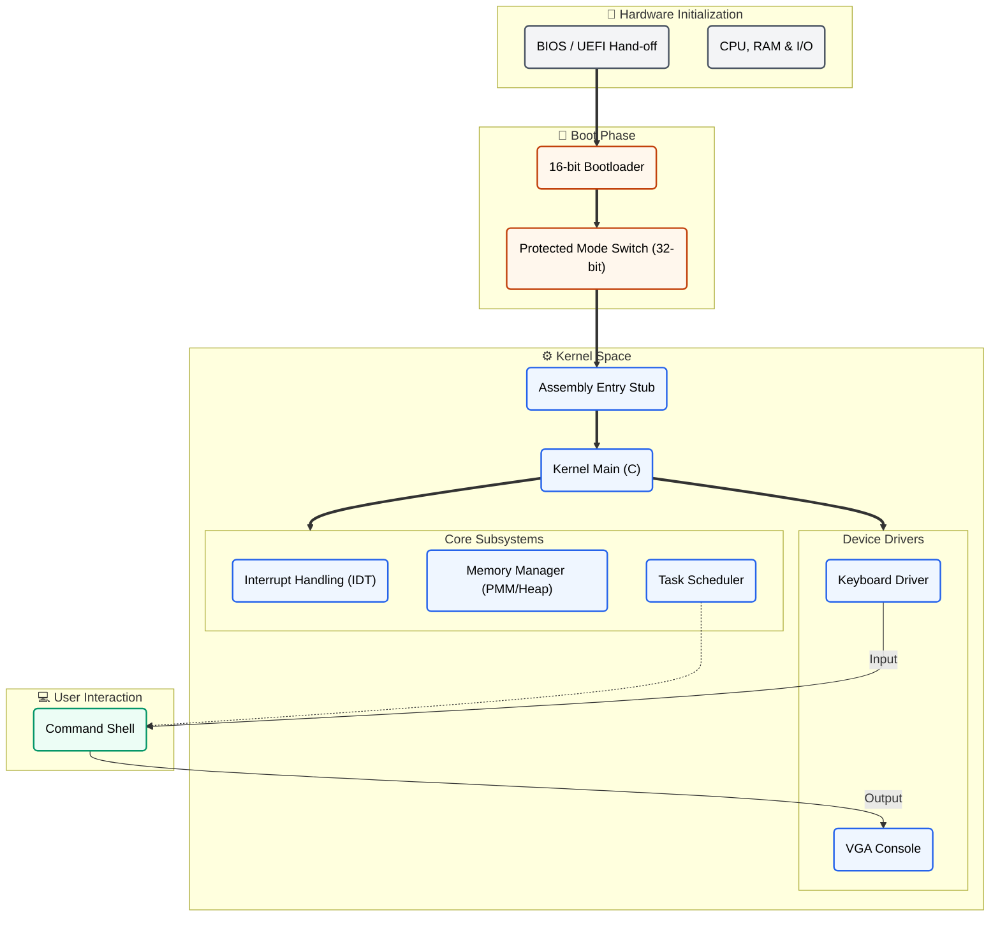

# ParamOS Architecture

This document visualizes the high-level architecture of ParamOS, from the boot process to the kernel shell.

## Description

1.  **Bootloader**: A minimal 16-bit bootloader (`boot.asm`) loads the kernel, enables the A20 line, and switches the CPU to 32-bit protected mode.
2.  **Kernel Entry**: An assembly stub (`kernel_entry.asm`) sets up the segment registers and stack before jumping to the C kernel.
3.  **Kernel Core**: `kernel.c` initializes the primary subsystems:
    *   **Interrupts**: Sets up the IDT and remaps the PIC to handle hardware interrupts (Timer, Keyboard).
    *   **Memory**: Initializes physical frame allocation and a simple kernel heap (`kmalloc`).
    *   **Drivers**: Configures the VGA console for output and the PS/2 keyboard for input.
4.  **Task Management**: Creates task structures and facilitates context switching. The scheduler currently uses cooperative multitasking or basic preemption.
5.  **Shell**: The primary interactive task runs in kernel mode (for now), accepting user input and executing commands.
